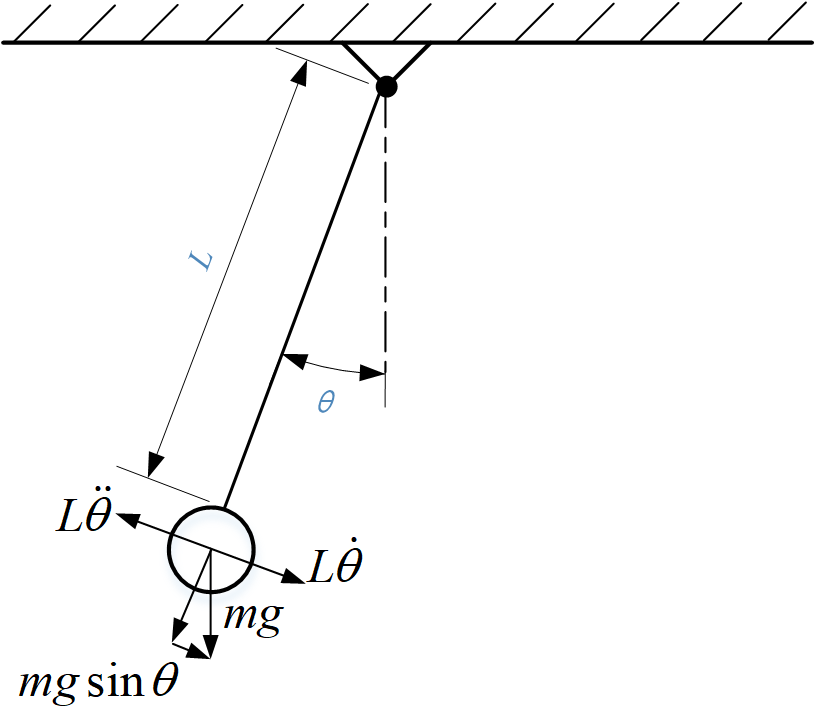
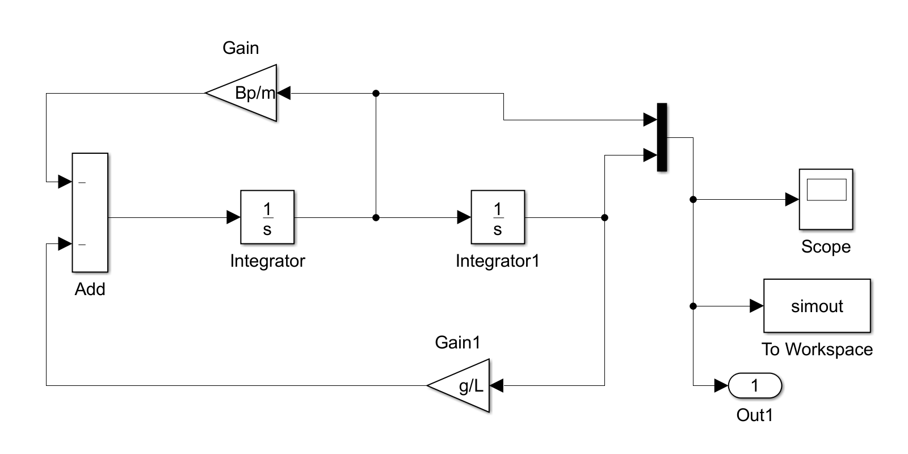
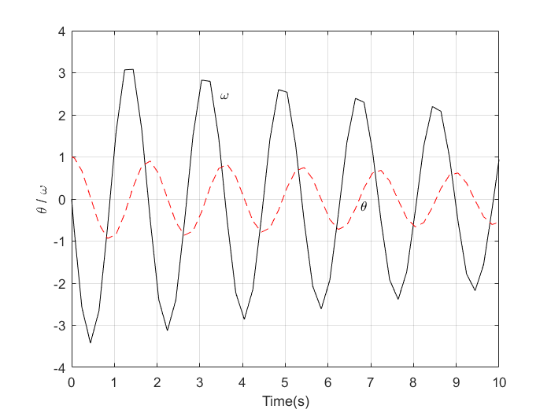

对于简单单摆系统，如下图所示，假设杆的长度为$L$且质量不计，钢球的质量为$m$，单摆的运动可以以线性的微分方程来近似，但事实上系统的行为是非线性的，而且存在粘滞阻尼，
假设粘滞阻尼系数为${B_p}(kg/ms^{-1})$。
 

    

<b>单摆系统</b>

 

$\theta$为杆摆动的角度，钢球末端的速度为$L\dot{\theta}$，切线方向的受力使钢球产生切向加速度，$L\ddot{\theta}$，按照牛顿第二定律，可以写成单摆系统的运动方程：

$$-mgsin\theta - B_pL\dot{\theta} = mL\ddot{\theta}$$

重写上式：

$$\ddot{\theta} + \frac{B_p}{m}\dot{\theta} + \frac{g}{L}sin\theta = 0$$

对于很小角度的单摆运动，可假设$sin\theta \approx \theta, cos\theta \approx 1$，故上式可改写为：

$$\ddot{\theta} + \frac{B_p}{m}\dot{\theta} + \frac{g}{L}\theta = 0$$

将上式简化为：
$$\ddot{\theta} = - \frac{B_p}{m}\dot{\theta} - \frac{g}{L}\theta$$
在Simulink环境中建立框图模型“pendulum.slx”。并在“pendulumm.m”文件中定义：$B_p=0.03;g=9.81;L=0.8;m=0.3$，然后运行。
 

    

<b>Simulink模型</b>

 

设置初始角度的$1 rad$，因存在阻尼，因此角度与角速度都渐渐趋近于零。

在Simulink环境中运行完成后，再运行“pendulumPlot.m”得到仿真图像。（注意Simulink输出的参数格式改为Array）
 

    

<b>单摆运动变化图</b>

 
